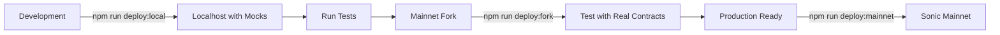

# 🚀 Arca Deployment Guide

This guide provides a comprehensive overview of deploying the Arca vault system across different environments.

## Overview

The Arca deployment system follows a **two-tier testing strategy**:

1. **Development Tier**: Local testing with mocks + Mainnet fork testing  
2. **Production Tier**: Direct deployment to Sonic mainnet

> **Note**: We skip Sonic testnet deployment because it lacks the necessary Metropolis DLMM contracts. Instead, we use mainnet forks for production-accurate testing.

## Quick Start

### Prerequisites

1. **Install dependencies**:
   ```bash
   npm install
   git submodule update --init --recursive  # For joe-v2 library
   ```

2. **Set up environment variables**:
   ```bash
   cp .env.example .env
   # Edit .env with your configuration
   ```

3. **Compile contracts**:
   ```bash
   npm run compile
   ```

### Deployment Commands

```bash
# Deploy to any network (auto-detects from --network flag)
npm run deploy --network <network-name>

# Or use specific shortcuts:
npm run deploy:local      # Deploy to localhost with mocks
npm run deploy:fork       # Deploy to mainnet fork
npm run deploy:mainnet    # Deploy to Sonic mainnet
```

## Deployment Flow



## Environment Configurations

### 1. Localhost Development

- **Network**: `localhost` (Hardhat node)
- **Purpose**: Initial development and unit testing
- **Features**: 
  - Automatically deploys mock contracts
  - Funds test accounts
  - Fast iteration cycle

#### Deployment Workflow
```bash
# Start local node
npx hardhat node

# Deploy in another terminal
npm run deploy:local
```

#### Post-Deployment Commands
```bash
# Verify deployment integrity
npm run deploy:verify:local

# Run comprehensive integration tests
npm run deploy:test:local

# Export addresses for UI development
npm run deploy:export

# Reset blockchain when needed
npm run dev:reset
```

#### When to Use
- Daily development work
- Unit testing new features
- UI development and testing
- Quick iteration cycles

### 2. Mainnet Fork Testing

- **Network**: `sonic-fork`
- **Purpose**: Production-accurate testing with real contracts
- **Features**:
  - Uses real mainnet contract addresses
  - Tests against actual liquidity and state
  - Zero cost testing with real DeFi environment

#### Deployment Workflow
```bash
# Start fork (requires Alchemy API key)
npx hardhat node --fork https://sonic-mainnet.g.alchemy.com/v2/YOUR_KEY

# Deploy to fork
npm run deploy:fork
```

#### Post-Deployment Commands
```bash
# Verify deployment with real contracts
npm run deploy:verify:fork

# Run integration tests against real liquidity
npm run deploy:test:fork

# Discover actual Metropolis rewarder addresses
npm run dev:discover

# Export addresses for staging environment
npm run deploy:export
```

#### When to Use
- Before mainnet deployment
- Testing against real market conditions
- Validating integration with live Metropolis contracts
- Final verification before production

### 3. Sonic Mainnet

- **Network**: `sonic-mainnet`
- **Purpose**: Live production deployment
- **Features**:
  - Production deployment with real value
  - Requires funded deployer account
  - Permanent on-chain deployment

#### Pre-Deployment Check
```bash
# Validate readiness for mainnet
npm run dev:check
```

#### Deployment Workflow
```bash
# Deploy to mainnet
npm run deploy:mainnet
```

#### Post-Deployment Commands
```bash
# Verify deployment integrity
npm run deploy:verify:mainnet

# Export addresses for production UI
npm run deploy:export

# Verify contracts on block explorer
npx hardhat verify --network sonic-mainnet <contract-address>
```

#### Additional Production Steps
- Transfer ownership to multisig wallet
- Configure monitoring and alerts
- Update production UI with new addresses
- Document deployment for team

#### When to Use
- Production launches
- After successful fork testing
- When ready for real user funds

## Configuration Files

Network configurations are stored in `config/networks/`:

```
config/networks/
├── localhost.json      # Local development config
├── sonic-fork.json     # Fork testing config
└── sonic-mainnet.json  # Production config
```

### Configuration Structure

```json
{
  "name": "network-name",
  "chainId": 146,
  "deployment": {
    "binStep": 25,
    "vaultName": "Arca Vault",
    "vaultSymbol": "ARCA",
    "feeRecipient": "0x..."
  },
  "contracts": {
    "tokenX": "0x...",
    "tokenY": "0x...",
    "lbRouter": "0x...",
    // ... other contracts
  }
}
```

## Environment Variables

Create a `.env` file that's based off [.env.example](./.env.example).

## Architecture Overview

The deployment creates the following contract structure:

```
┌─────────────────────┐
│   ArcaTestnetV1     │ ← Main Vault (UUPS Proxy)
│    (Main Vault)     │
└──────────┬──────────┘
           │ owns
    ┌──────┴──────┬─────────────┬──────────────┐
    ▼             ▼             ▼              ▼
┌──────────┐ ┌──────────┐ ┌──────────┐ ┌──────────┐
│  Queue   │ │   Fee    │ │  Reward  │ │ Registry │
│ Handler  │ │ Manager  │ │ Claimer  │ │          │
└──────────┘ └──────────┘ └──────────┘ └──────────┘
 (Beacon)     (Beacon)     (UUPS)
```

### Proxy Patterns

- **UUPS Proxies**: Main Vault and Reward Claimer (upgradeable by owner)
- **Beacon Proxies**: Queue Handler and Fee Manager (batch upgradeable)

## Command Reference

### Core Deployment Commands
| Command | Description | Network |
|---------|-------------|---------|
| `npm run deploy --network <name>` | Universal deployment to any network | Any |
| `npm run deploy:local` | Deploy to localhost with mocks | localhost |
| `npm run deploy:fork` | Deploy to mainnet fork | sonic-fork |
| `npm run deploy:mainnet` | Deploy to Sonic mainnet | sonic-mainnet |

### Post-Deployment Commands
| Command | Description | Usage |
|---------|-------------|-------|
| `npm run deploy:verify:local` | Verify localhost deployment | After localhost deployment |
| `npm run deploy:verify:fork` | Verify fork deployment | After fork deployment |
| `npm run deploy:verify:mainnet` | Verify mainnet deployment | After mainnet deployment |
| `npm run deploy:test:local` | Test localhost deployment | localhost integration testing |
| `npm run deploy:test:fork` | Test fork deployment | fork integration testing |
| `npm run deploy:export` | Export addresses for UI integration | After successful deployment |

### Development Utilities
| Command | Description | When to Use |
|---------|-------------|-------------|
| `npm run dev:reset` | Reset local blockchain state | Clean up localhost |
| `npm run dev:check` | Check mainnet deployment readiness | Before mainnet deployment |
| `npm run dev:discover` | Discover Metropolis rewarder addresses | Configuration setup |

### 3. Contract Verification

For mainnet deployments, verify on block explorer:

```bash
npx hardhat verify --network sonic-mainnet <contract-address>
```

## Security Checklist

Before mainnet deployment:

- [ ] Contracts audited by security firm
- [ ] Deployment tested on mainnet fork
- [ ] Multi-signature wallet prepared for ownership
- [ ] Emergency pause mechanisms tested
- [ ] Monitoring and alerts configured
- [ ] Incident response plan documented

## Troubleshooting

### Common Issues

1. **"Network configuration not found"**
   - Ensure config file exists in `config/networks/`
   - Check network name matches exactly

2. **"Insufficient funds"**
   - Deployer needs ~0.5 ETH for full deployment
   - Check balance before deployment

3. **Contract size limit exceeded**
   - Contracts are optimized but monitor size
   - Run `npm run compile` to check sizes

4. **Fork deployment fails**
   - Ensure fork is running with correct block number
   - Check mainnet contracts exist at configured addresses

### Getting Help

1. Check deployment logs in `deployments/<network>/latest.json`
2. Run verification script for detailed diagnostics
3. Review error messages for specific contract failures

## Contract Addresses

### Sonic Mainnet

| Contract | Address |
|----------|---------|
| Token X (wS) | 0x039e2fB66102314Ce7b64Ce5Ce3E5183bc94aD38 |
| Token Y (USDC) | 0x29219dd400f2Bf60E5a23d13Be72B486D4038894 |
| LB Router | 0x67803fe6d76409640efDC9b7ABcD2c6c2E7cBa48 |
| LB Pair (wS-USDC) | 0x11d899dec22fb03a0047212b1a20a7ad8d699420 |
| METRO Token | 0x71E99522EaD5E21CF57F1f542Dc4ad2E841F7321 |

## Best Practices

1. **Always test on fork first** - Catch issues before mainnet
2. **Use deployment scripts** - Avoid manual deployment errors  
3. **Save artifacts** - Keep deployment history for debugging
4. **Verify immediately** - Ensure source code is public
5. **Transfer ownership carefully** - Use multi-sig for production

---

For development guidelines, see [CLAUDE.md](./CLAUDE.md)