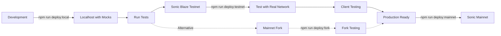

# 🚀 Arca Deployment Guide

This guide provides a comprehensive overview of deploying the Arca vault system across different environments.

## Overview

The Arca deployment system follows a **three-tier testing strategy**:

1. **Development Tier**: Local testing with mocks for rapid development  
2. **Testnet Tier**: Sonic Blaze Testnet deployment for safe integration testing
3. **Production Tier**: Direct deployment to Sonic mainnet

> **New**: Sonic Blaze Testnet now has full Metropolis DLMM contract support, enabling safe testing with real network conditions using free testnet tokens. Fork testing remains available as an alternative.

> **Multi-Vault Support**: The deployment system now supports deploying multiple vaults in a single command, with shared infrastructure and token reuse across vaults.

## Quick Start

### Prerequisites

1. **Install dependencies**:
   ```bash
   npm install
   git submodule update --init --recursive  # For joe-v2 library
   ```

2. **Set up environment variables**:
   ```bash
   cp .env.example .env
   # Edit .env with your configuration
   ```

3. **Compile contracts**:
   ```bash
   npm run compile
   ```

### Deployment Commands

```bash
# Deploy to any network (auto-detects from --network flag)
npm run deploy --network <network-name>

# Or use specific shortcuts:
npm run deploy:local      # Deploy to localhost with mocks
npm run deploy:testnet    # Deploy to Sonic Blaze Testnet
npm run deploy:fork       # Deploy to mainnet fork
npm run deploy:mainnet    # Deploy to Sonic mainnet

# Multi-vault deployment options:
npm run deploy --network <name> --vaults "ws-usdc,metro-usdc"  # Deploy specific vaults
npm run deploy --network <name> --resume                       # Resume failed deployment
```

## Deployment Flow



## Environment Configurations

### 1. Localhost Development

- **Network**: `localhost` (Hardhat node)
- **Purpose**: Initial development and unit testing
- **Features**: 
  - Automatically deploys mock contracts
  - Funds test accounts
  - Fast iteration cycle

#### Deployment Workflow
```bash
# Start local node
npx hardhat node

# Deploy in another terminal
npm run deploy:local
```

#### Post-Deployment Commands
```bash
# Verify deployment integrity
npm run deploy:verify:local

# Run comprehensive integration tests
npm run deploy:test:local

# Export addresses for UI development
npm run deploy:export

# Reset blockchain when needed
npm run dev:reset
```

#### When to Use
- Daily development work
- Unit testing new features
- UI development and testing
- Quick iteration cycles

### 2. Sonic Blaze Testnet

- **Network**: `sonic-testnet`
- **Chain ID**: `57054`
- **RPC**: `https://sonic-blaze.g.alchemy.com/v2/YOUR_API_KEY`
- **Purpose**: Safe integration testing with real network conditions using free tokens
- **Features**:
  - Real Metropolis DLMM contracts and liquidity
  - Free testnet tokens from official faucet
  - Production-like environment without financial risk
  - Client alpha testing and demo environments

#### Deployment Workflow
```bash
# Check testnet readiness and get faucet info
npm run dev:testnet:faucet

# Check current testnet status
npm run dev:testnet:status

# Deploy to testnet
npm run deploy:testnet
```

#### Post-Deployment Commands
```bash
# Verify deployment integrity
npm run deploy:verify:testnet

# Run integration tests on testnet
npm run deploy:test:testnet

# Export addresses for UI testing
npm run deploy:export
```

#### Testnet Setup Guide
1. **Get Testnet Tokens**:
   - Visit faucet: https://testnet.soniclabs.com/account
   - Connect wallet or enter address
   - Request testnet S tokens

2. **Add Testnet to Wallet**:
   - Network Name: Sonic Blaze Testnet
   - RPC URL: https://rpc.blaze.soniclabs.com (or Alchemy)
   - Chain ID: 57054
   - Currency Symbol: S
   - Block Explorer: https://testnet.sonicscan.org

3. **Verify Contracts**:
   - All Metropolis contracts deployed and verified
   - Real liquidity pools available for testing
   - METRO rewards system functional

#### When to Use
- Before mainnet deployment (always recommended)
- Client alpha testing and demos
- Integration testing with real contracts
- UI testing with production-like environment
- Training new team members safely

### 3. Mainnet Fork Testing

- **Network**: `sonic-fork`
- **Purpose**: Production-accurate testing with real contracts
- **Features**:
  - Uses real mainnet contract addresses
  - Tests against actual liquidity and state
  - Zero cost testing with real DeFi environment

#### Deployment Workflow
```bash
# Start fork (requires Alchemy API key)
npx hardhat node --fork https://sonic-mainnet.g.alchemy.com/v2/YOUR_KEY

# Deploy to fork
npm run deploy:fork
```

#### Post-Deployment Commands
```bash
# Verify deployment with real contracts
npm run deploy:verify:fork

# Run integration tests against real liquidity
npm run deploy:test:fork

# Discover actual Metropolis rewarder addresses
npm run dev:discover

# Export addresses for staging environment
npm run deploy:export
```

#### When to Use
- Before mainnet deployment
- Testing against real market conditions
- Validating integration with live Metropolis contracts
- Final verification before production

### 4. Sonic Mainnet

- **Network**: `sonic-mainnet`
- **Purpose**: Live production deployment
- **Features**:
  - Production deployment with real value
  - Requires funded deployer account
  - Permanent on-chain deployment

#### Pre-Deployment Check
```bash
# Validate readiness for mainnet
npm run dev:check
```

#### Deployment Workflow
```bash
# Deploy to mainnet
npm run deploy:mainnet
```

#### Post-Deployment Commands
```bash
# Verify deployment integrity
npm run deploy:verify:mainnet

# Export addresses for production UI
npm run deploy:export

# Verify contracts on block explorer
npx hardhat verify --network sonic-mainnet <contract-address>
```

#### Additional Production Steps
- Transfer ownership to multisig wallet
- Configure monitoring and alerts
- Update production UI with new addresses
- Document deployment for team

#### When to Use
- Production launches
- After successful fork testing
- When ready for real user funds

## Configuration Files

Network configurations are stored in `config/networks/`:

```
config/networks/
├── localhost.json      # Local development config
├── sonic-fork.json     # Fork testing config
└── sonic-mainnet.json  # Production config
```

### Configuration Structure

#### Single Vault Configuration (Legacy)
```json
{
  "name": "network-name",
  "chainId": 146,
  "deployment": {
    "binStep": 25,
    "vaultName": "Arca Vault",
    "vaultSymbol": "ARCA",
    "feeRecipient": "0x..."
  },
  "contracts": {
    "tokenX": "0x...",
    "tokenY": "0x...",
    "lbRouter": "0x...",
    // ... other contracts
  }
}
```

#### Multi-Vault Configuration (Recommended)
```json
{
  "name": "localhost",
  "chainId": 31337,
  "sharedContracts": {
    "metroToken": "DEPLOY_MOCK",     // or address
    "lbRouter": "DEPLOY_MOCK",        // or address
    "lbFactory": "DEPLOY_MOCK"        // or address
  },
  "vaults": [
    {
      "id": "ws-usdc",
      "enabled": true,
      "tokens": {
        "tokenX": { "symbol": "wS", "decimals": 18, "deployMock": true },
        "tokenY": { "symbol": "USDC", "decimals": 6, "deployMock": true }
      },
      "lbPair": { "deployMock": true, "binStep": 25 },
      "deployment": {
        "vaultName": "Arca wS-USDC Vault",
        "vaultSymbol": "ARCA-wS-USDC",
        "feeRecipient": "0x..."
      }
    },
    {
      "id": "metro-usdc",
      "enabled": true,
      "tokens": {
        "tokenX": { "symbol": "METRO", "decimals": 18, "deployMock": false },
        "tokenY": { "symbol": "USDC", "decimals": 6, "deployMock": false }  // Reuses USDC
      },
      "lbPair": { "deployMock": true, "binStep": 25 },
      "deployment": {
        "vaultName": "Arca METRO-USDC Vault",
        "vaultSymbol": "ARCA-METRO-USDC"
      }
    }
  ]
}
```

## Environment Variables

Create a `.env` file that's based off [.env.example](./.env.example).

## Architecture Overview

### Single Vault Structure
```
┌─────────────────────┐
│   ArcaTestnetV1     │ ← Main Vault (UUPS Proxy)
│    (Main Vault)     │
└──────────┬──────────┘
           │ owns
    ┌──────┴──────┬─────────────┬──────────────┐
    ▼             ▼             ▼              ▼
┌──────────┐ ┌──────────┐ ┌──────────┐ ┌──────────┐
│  Queue   │ │   Fee    │ │  Reward  │ │ Registry │
│ Handler  │ │ Manager  │ │ Claimer  │ │          │
└──────────┘ └──────────┘ └──────────┘ └──────────┘
 (Beacon)     (Beacon)     (UUPS)
```

### Multi-Vault Architecture
```
                    ┌─────────────────┐
                    │ Vault Registry  │ ← Tracks all vaults
                    └────────┬────────┘
                             │
        ┌────────────────────┴────────────────────┐
        │                                         │
┌───────▼────────┐                      ┌────────▼────────┐
│ Vault 1        │                      │ Vault 2         │
│ (wS-USDC)      │                      │ (METRO-USDC)    │
└───────┬────────┘                      └────────┬────────┘
        │                                         │
   ┌────┴────┬──────────┬──────────┐  ┌─────────┴──────────────┐
   ▼         ▼          ▼          ▼  ▼                        ▼
┌──────┐ ┌──────┐ ┌──────────┐ ┌──────┐                   ┌──────────┐
│Queue │ │ Fee  │ │ Reward   │ │Queue │     Shared        │ Reward   │
│Hand. │ │ Mgr  │ │ Claimer  │ │Hand. │    Beacons       │ Claimer  │
└──────┘ └──────┘ └──────────┘ └──────┘                   └──────────┘
                                                               
                    Shared Infrastructure:
                    - METRO Token (all vaults)
                    - LB Router (all vaults)
                    - Token reuse (e.g., USDC)
```

### Proxy Patterns

- **UUPS Proxies**: Main Vault and Reward Claimer (upgradeable by owner)
- **Beacon Proxies**: Queue Handler and Fee Manager (batch upgradeable)
- **Shared Beacons**: All queue handlers and fee managers share beacons for unified upgrades

## Command Reference

### Core Deployment Commands
| Command | Description | Network |
|---------|-------------|---------|
| `npm run deploy --network <name>` | Universal deployment to any network | Any |
| `npm run deploy:local` | Deploy to localhost with mocks | localhost |
| `npm run deploy:testnet` | Deploy to Sonic Blaze Testnet | sonic-testnet |
| `npm run deploy:fork` | Deploy to mainnet fork | sonic-fork |
| `npm run deploy:mainnet` | Deploy to Sonic mainnet | sonic-mainnet |

### Post-Deployment Commands
| Command | Description | Usage |
|---------|-------------|-------|
| `npm run deploy:verify:local` | Verify localhost deployment | After localhost deployment |
| `npm run deploy:verify:testnet` | Verify testnet deployment | After testnet deployment |
| `npm run deploy:verify:fork` | Verify fork deployment | After fork deployment |
| `npm run deploy:verify:mainnet` | Verify mainnet deployment | After mainnet deployment |
| `npm run deploy:test:local` | Test localhost deployment | localhost integration testing |
| `npm run deploy:test:testnet` | Test testnet deployment | testnet integration testing |
| `npm run deploy:test:fork` | Test fork deployment | fork integration testing |
| `npm run deploy:export` | Export addresses for UI integration | After successful deployment |

### Development Utilities
| Command | Description | When to Use |
|---------|-------------|-------------|
| `npm run dev:reset` | Reset local blockchain state | Clean up localhost |
| `npm run dev:check` | Check mainnet deployment readiness | Before mainnet deployment |
| `npm run dev:discover` | Discover Metropolis rewarder addresses | Configuration setup |
| `npm run dev:testnet:faucet` | Get testnet faucet info and check balance | Testnet setup |
| `npm run dev:testnet:status` | Check testnet readiness and contract status | Before testnet deployment |

### Deployment Progress Management
| Command | Description | When to Use |
|---------|-------------|-------------|
| `npx hardhat run scripts/clean-deployment-progress.ts --network <name>` | Clean deployment progress (remove duplicates) | After failed deployments |
| `RESET_PROGRESS=true npx hardhat run scripts/clean-deployment-progress.ts --network <name>` | Reset deployment progress completely | Start fresh deployment |

### 3. Contract Verification

For testnet and mainnet deployments, verify on block explorer:

```bash
# Verify on testnet
npx hardhat verify --network sonic-testnet <contract-address>

# Verify on mainnet
npx hardhat verify --network sonic-mainnet <contract-address>
```

## Security Checklist

Before mainnet deployment:

- [ ] Contracts audited by security firm
- [ ] Deployment tested on mainnet fork
- [ ] Multi-signature wallet prepared for ownership
- [ ] Emergency pause mechanisms tested
- [ ] Monitoring and alerts configured
- [ ] Incident response plan documented

## Troubleshooting

### Common Issues

1. **"Network configuration not found"**
   - Ensure config file exists in `config/networks/`
   - Check network name matches exactly

2. **"Insufficient funds"**
   - Deployer needs ~0.5 ETH for full deployment
   - Check balance before deployment

3. **Contract size limit exceeded**
   - Contracts are optimized but monitor size
   - Run `npm run compile` to check sizes

4. **Fork deployment fails**
   - Ensure fork is running with correct block number
   - Check mainnet contracts exist at configured addresses

### Getting Help

1. Check deployment logs:
   - Single vault: `deployments/<network>/latest.json`
   - Multi-vault: `deployments/<network>/latest-multi-vault.json`
2. Run verification script for detailed diagnostics
3. Review error messages for specific contract failures
4. Check deployment progress in multi-vault deployments

## Contract Addresses

### Sonic Blaze Testnet

| Contract | Address |
|----------|---------|
| Token X (S) | 0x039e2fB66102314Ce7b64Ce5Ce3E5183bc94aD38 |
| Token Y (USDC) | 0x1570300e9cFEC66c9Fb0C8bc14366C86EB170Ad0 |
| LB Router | 0xe77DA7F5B6927fD5E0e825B2B27aca526341069B |
| LB Factory | 0x90F28Fe6963cE929d4cBc3480Df1169b92DD22B7 |
| LB Pair (S-USDC) | 0xf931d5d6a019961096aaf4749e05d123e1b38a55 |
| METRO Token | 0x71E99522EaD5E21CF57F1f542Dc4ad2E841F7321 |

### Sonic Mainnet

| Contract | Address |
|----------|---------|
| Token X (wS) | 0x039e2fB66102314Ce7b64Ce5Ce3E5183bc94aD38 |
| Token Y (USDC) | 0x29219dd400f2Bf60E5a23d13Be72B486D4038894 |
| LB Router | 0x67803fe6d76409640efDC9b7ABcD2c6c2E7cBa48 |
| LB Pair (wS-USDC) | 0x11d899dec22fb03a0047212b1a20a7ad8d699420 |
| METRO Token | 0x71E99522EaD5E21CF57F1f542Dc4ad2E841F7321 |

## Multi-Vault Deployment Guide

### Key Features

1. **Deploy Multiple Vaults**: Deploy any number of vaults in a single command
2. **Token Reuse**: Automatically reuses deployed tokens across vaults (e.g., USDC shared between multiple pairs)
3. **Shared Infrastructure**: Single registry, shared beacon proxies for batch upgrades
4. **Resume Capability**: Failed deployments can be resumed from where they left off
5. **Progress Tracking**: Real-time deployment progress with detailed logging

### Multi-Vault Commands

```bash
# Deploy all enabled vaults in config
npm run deploy --network localhost

# Deploy specific vaults only (using environment variables)
DEPLOY_VAULTS="ws-usdc,metro-usdc" npm run deploy --network testnet

# Resume a failed deployment
DEPLOY_RESUME=true npm run deploy --network localhost

# Combine resume and specific vaults
DEPLOY_RESUME=true DEPLOY_VAULTS="test1-usdc" npm run deploy --network testnet
```

### Deployment Process

1. **Shared Infrastructure**: Deploys registry, beacons, and shared contracts first
2. **Token Deployment**: Deploys tokens once and reuses across vaults
3. **Vault Deployment**: Deploys each vault with its supporting contracts
4. **Registry Updates**: Registers all vaults for easy discovery
5. **Progress Saving**: Saves progress after each step for resume capability

### Progress Management

The deployment system tracks progress in `deployments/<network>/multi-vault-progress.json`:
- Successfully deployed vaults are tracked in `deployedVaults`
- Failed vault attempts are recorded in `failedVaults`
- Deployed tokens and LB pairs are saved for reuse
- Shared infrastructure addresses are preserved

**Handling Failed Deployments**:
1. Failed vaults are automatically removed from the failed list when successfully deployed
2. Use the cleanup script to remove duplicate entries: `npx hardhat run scripts/clean-deployment-progress.ts --network <name>`
3. To start completely fresh: `RESET_PROGRESS=true npx hardhat run scripts/clean-deployment-progress.ts --network <name>`

**Note on Rewarders**: Newly created LB pairs won't have METRO rewarders attached. Production pools typically have rewarders for METRO token distribution, but test pools created via factory won't have them initially.

### Testnet Deployment with Custom Tokens

For testnet deployments with custom tokens:

1. **Deploy Mock Tokens**: Set `deployMock: true` for test tokens
2. **Create LB Pairs**: System will create pairs via factory if needed
3. **Add Initial Liquidity**: Manually add liquidity through Metropolis UI
4. **Test Operations**: Verify vault operations with test tokens

### Example: Adding a New Vault

1. Edit your network config file:
```json
{
  "vaults": [
    // ... existing vaults ...
    {
      "id": "new-token-usdc",
      "enabled": true,
      "tokens": {
        "tokenX": { "symbol": "NEW", "decimals": 18, "deployMock": true },
        "tokenY": { "symbol": "USDC", "decimals": 6, "deployMock": false }
      },
      "lbPair": { "deployMock": true, "binStep": 25 },
      "deployment": {
        "vaultName": "Arca NEW-USDC Vault",
        "vaultSymbol": "ARCA-NEW-USDC"
      }
    }
  ]
}
```

2. Deploy the new vault:
```bash
DEPLOY_VAULTS="new-token-usdc" npm run deploy --network localhost
```

### Deployment Artifacts

Multi-vault deployments save comprehensive artifacts:

- **Deployment Log**: `deployments/<network>/latest-multi-vault.json`
- **Progress File**: `deployments/<network>/multi-vault-progress.json`
- **Individual Vaults**: Accessible via registry contract
- **Shared Infrastructure**: Beacons, tokens, and registry addresses

## Best Practices

1. **Always test on testnet first** - Safe testing with real network conditions using free tokens
2. **Use testnet for client demos** - Show functionality without financial risk
3. **Fork testing as alternative** - Catch specific mainnet edge cases
4. **Use deployment scripts** - Avoid manual deployment errors  
5. **Save artifacts** - Keep deployment history for debugging
6. **Verify immediately** - Ensure source code is public on both testnet and mainnet
7. **Transfer ownership carefully** - Use multi-sig for production
8. **Plan vault configurations** - Design token pairs and parameters before deployment
9. **Monitor gas usage** - Multi-vault deployments can be gas-intensive
10. **Use resume capability** - Don't restart failed deployments from scratch

---

For development guidelines, see [CLAUDE.md](./CLAUDE.md)

## Future Improvements

### Developer Experience
- **Convert deployment scripts to Hardhat tasks**: Currently using environment variables (DEPLOY_RESUME, DEPLOY_VAULTS) due to Hardhat's script limitations. Hardhat tasks would provide:
  - Proper parameter validation
  - Built-in help text (`npx hardhat help deploy-vaults`)
  - Cleaner CLI interface
  - Better error messages for invalid parameters
  - Example: `npx hardhat deploy-vaults --resume --vaults "ws-usdc,metro-usdc" --network testnet`